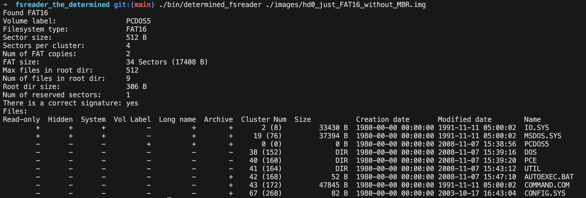
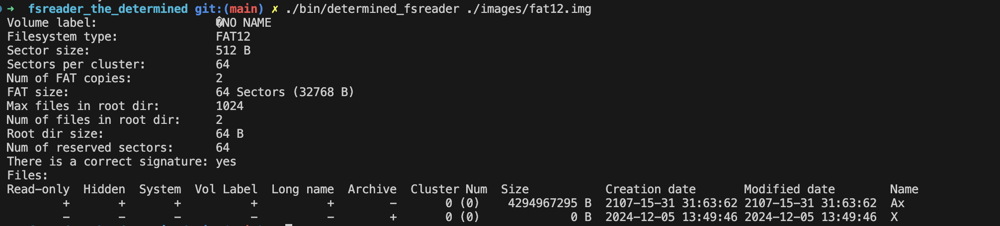
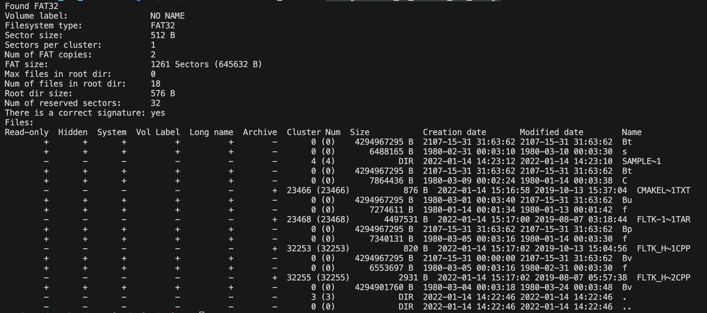
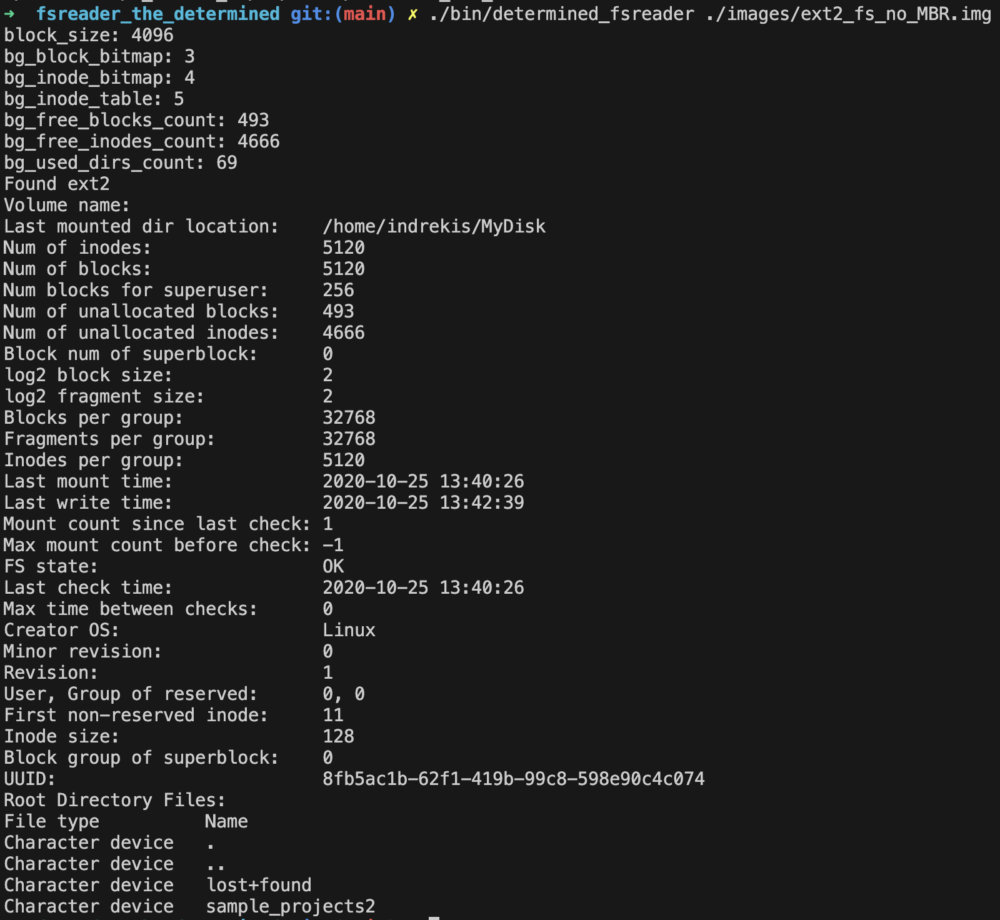

# Lab work 10: Робота із бінарними даними на прикладі читання образу диску FS FATxx / ext2 FS

Authors (team):

- Alina Babenko: https://github.com/rediskaJunior

- Husiev Radomyr: https://github.com/rhusiev

## Prerequisites

- C++
- cmake
- make
- linux or ubuntA
- knowledge of creating images in the terminal 
- panOleg's blog

### Compilation

```bash
./compile.sh -d # or -o for optimized (release) build
```

### Installation

```bash
./compile.sh -d
```

### Usage

We decided to implement FAT16 first, so in the main task it will be FAT16 (how unpredictable :> )

After compilation we need to get to the binary file

```bash
cd ./bin/determined_fsreader ./images/hd0_just_FAT16_without_MBR.img     #test variant
```

### Results

After this we can see the result using FAT16 image:



# Additional tasks

We made 2 additional tasks:

* FAT12 + FAT16 + FAT32 + exFAT  -- до 10 балів.
* Ext2fs + FAT16 + FAT32 -- до 10.

We implemented all of these and now will show how this works.

<mark> FAT12 </mark>

```bash
cd ./bin/determined_fsreader ./images/fat12.img 
```



<mark> FAT32 </mark>

```bash
cd ./bin/determined_fsreader ./images/fat32_fs_without_mbr_2.img 
```



<mark> EXT2FS </mark>

```bash
cd ./bin/determined_fsreader ./images/ext2_fs_no_MBR.img
```

 # We need this!!!
